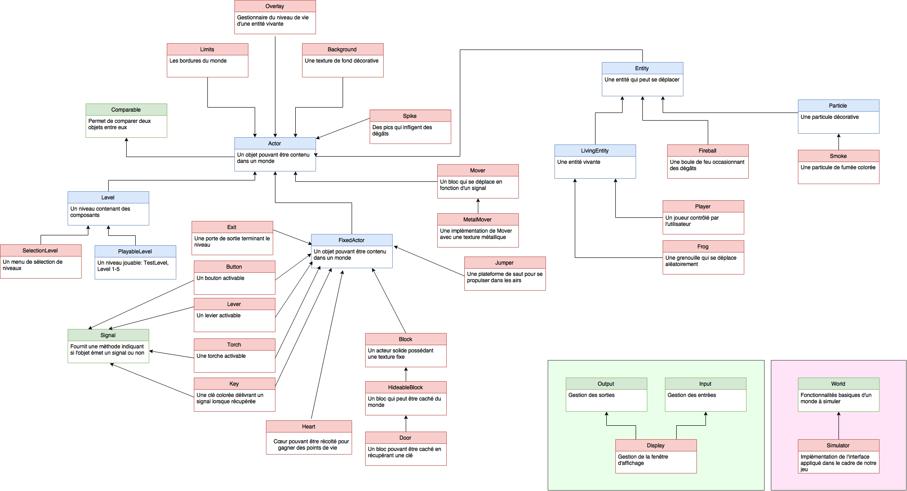

[//]: # (Pour voir ce fichier mis en page, veuillez utiliser un lecteur Markdown, comme par exemple http://dillinger.io)

#Miniprojet 2: Jeux de plateforme

Réalisé par : _Florian CASSAYRE_ et _Moussa PRINCE_

## Compte-rendu
Ce projet nous a permis de mettre en pratique les concepts de la POO vus en cours, notamment les notions d'héritage et de polymorphisme. Au delà de l'aspect ludique de la création d'un jeu de plateforme, c'est le fait de manipuler des objets avec des propriétés spécifiques, et surtout le lien entre ces objets, qui a été intéressant à mettre en place, même si nous étions guidés. Il n'y a rien de mieux que des objets de la vie réelle (clés, portes...), certes mis en place dans un monde virtuel, mais qui permettent néanmoins de mieux visualiser des relations abstraites, en les concrétisant. Nous espérons que la lecture de ce Miniprojet 2 vous sera agréable.

## Modifications notables
De nombreux ajouts et ajustements ont été faits principalement pour rendre le jeu plus réaliste, plus fluide, ou tout simplement pour répondre à certains de nos caprices parfois, il faut l'avouer.

- Modification du facteur de zoom, plus dynamique
- Modification d'un bug qui permet au joueur de "s'accorcher" sur le coté d'un bloc
- `Mover`: n'hérite pas de `Block` dans notre structure, étant donné qu'il n'est pas fixe + mise en place d'une interpolation cubique
- Pics: possibilité de modifier l'orientation
- Boules de feu: disparition après un moment + effets de frottement (plus réaliste)
- Jumper: adaptation de la vitesse de saut (plus réaliste)
- Touches gauche et droite moins réactives (plus réaliste)

Voilà, nous espérons ne pas avoir oublié d'autres modifications, en tout cas le principal a été mentionné.

## Schéma structurel

Vous pouvez obtenir une vue d'ensemble de la structure en vous référant au schéma UML ci-dessous :

## Structure des paquets

### `platform.game.block`

##### `solid`

Contient les objets solides infranchissables (blocs, portes, movers...).

##### `transparent`

Contient les objets transparents qu'un joueur peut traverser (levier, torche, jumper...).

### `platform.game.entity`

##### `living`

Contient les entités vivantes (joueur, grenouille...), ainsi que le gestionnaire de leur niveau de vie (Overlay).

##### `particle`

Contient les effets physiques (fumée...).

##### `projectile`

Contient les objets à lancer (boules de feu...).

### `platform.game.environment`

Contient les éléments liés à l'environnement des acteurs (limites du monde, image de fond...).

### `platform.game.gui`

Contient les éléments liés à l'interface utilisateur (menu de sélection, boutons de sélection...)..

### `platform.game.item`

Contient les objets à récupérer par le joueur (cœurs, clés...).

### `platform.game.level`

Contient les niveaux de jeu, ainsi qu'un niveau de test.

### `platform.game.registry`

Contient les générateurs de blocs, utilisés pour concevoir les niveaux.

### `platform.game.signal`

Contient les signaux logiques (And, Or, Xor...).

### `platform.game.util`

Contient les utilitaires ainsi que les énumérations.

##### Interface `World`

"Fonctionnalités des mondes à simuler".

##### Classe `Simulator`

"Appelle en boucle la simulation de l'ensemble des acteurs et leur dessin".

## Acteurs

Ils héritent tous de la classe `Actor`, qui "modélise tout ce qui peut peupler le monde à simuler".

### `Entity`

Une entité qui possède une position et une vitesse.

##### `Particle`

Particules permettant de modéliser des effets décoratifs.

###### `Smoke`

Une particule de fumée colorée.

##### `LivingEntity`

Une entité vivante (joueur, monstre...). Ces entités ont la particularité de posséder un `Overlay` (coeurs) au-dessus d'elles.

###### `Player` *

Le joueur contrôlé par l'utilisateur. Il peut se déplacer et interagir avec le monde grâce au clavier et la souris.

###### `Frog`

Une grenouille qui se déplace aléatoirement. Elle est purement décorative (pour l'instant) et n'interagit pas avec le joueur.

##### `Fireball` *

Une boule enflamée qui retire des points de vie à celui qui la touchera. La boule de feu rebondit sur les parois solides, mais sa vélocité s'atténue. A la longue, elle finit par disparaitre laissant derrière elle un nuage de fumée.

### `FixedActor`

Une classe mère qui permet de définir un acteur par une boite (`Box`) **fixe** (typiquement un bloc ou un objet d'interaction).

#### `Block` *

Tous les éléments qui sont dessinés en fond et qui intéragissent avec les entités lorsque ces dernières entrent en collision avec eux. Leur texture ne change pas.

##### `HideableBlock`

Classe abstraite représentant un bloc pouvant être caché du monde (et qui, par la même occasion, n'intéragit plus avec ce monde).

###### `Door` *

Porte qui est liée à une clé colorée. La couleur de la porte est naturellement définie par la clé passée en constructeur.

#### `Jumper`*
Plateforme de saut qui lance le joueur dans les airs.

#### `Lever`*
Levier pouvant être activé ou désactivé avec la Touche E, pouvant servir de signal dans la résolution d'énigmes.

#### `Torch`*
Torche pouvant être activée en lançant une boule de feu avec la Touche Espace, ou désactivée en soufflant dessus avec la Touche B.

#### `Key`*
Clé pouvant être collectée et faisant disparaitre aussitôt la `Door` de même couleur.

#### `Heart`*
Cœur pouvant être collecté pour ravitaillement.

#### `Button`
Bloc bouton coloré au sol, activé une fois qu'on marche dessus.

#### `Exit`*
Porte permettant de sortir du niveau actuel.

### `Mover` *

Un bloc qui se déplace d'une position à une autre en fonction du signal passé en argument. Il est possible de choisir parmi deux modes d'interpolation, linéaire ou cubique (par défaut).

#### `MetalMover`

Très similaire à Mover, utilisant une texture prédéfinie.

### `Spike`*
Pics pouvant infliger des dégâts au joueur, et dont on peut choisir l'orientation initiale.

### `Level` *

##### `SelectionLevel`
Menu basique de sélection des niveaux.

##### `PlayableLevel`

Possède des méthodes supplémentaires (gestion du point d'apparition du joueur, les bordures...)

Niveaux jouables pour l'instant: `TestLevel`, `Level1`, `Level2`, `Level3`, `Level4`, `Level5`.

### `Background`
Image de fond, pour donner plus de couleurs à nos levels.

### `Limits`
Limites du monde dans lequel vivent les acteurs.

### `Overlay`*
Gestionnaire du niveau de vie des `LivingEntity`, qui affiche sous forme de cœurs le niveau de vie d'une entité vivante au-dessus de sa tête.

## Signaux

### `Signal` *

Interface qui possède une méthode retournant un booléen si l'objet est "actif" ou non. Peut représenter un élément d'activation tel qu'un interrupteur ou un bouton.

##### `ConstantSignal` *

Un signal constant retournant le booléen passé en argument.

##### `Not` *

Inverse le signal passé en argument.

##### `LogicGate`

Classe intermédiaire représentant une porte logique (deux entrées, une sortie).

###### `And` *

"ET" logique ; les deux signaux doivent être vrais en même temps.

###### `Or` *

"OU" logique ; un des deux signaux au moins doit être vrai.

###### `Xor`

"OU Exclusif" logique ; un des deux signaux mais pas les deux, doit être vrai.

## Classes utilitaires

### `ColoredItem`

Une énumération contenant quatre couleurs possibles (bleu, vert, rouge, jaune) pour les objets colorés (clé, porte, bouton). Elle permet de récupérer automatiquement le nom de la texture en fonction de la couleur spécifiée.

### `ColoredSmoke`

Similaire à `ColoredItem` mais adapté à la fumée.

### `Direction`

Une énumération des quatre directions possibles (haut, bas, gauche, droite). Elle sert à définir l'orientation d'un bloc, par exemple les pics (`Spike`).

### `InterpolationType`

Une énumération des types d'interpolation utilisables. Elle contient actuellement l'interpolation linéaire, et l'interpolation cubique. Cette énumération est utilisée par la classe `Mover` pour définir le type de transition. Elle pourrait également servir pour la transition entre deux niveaux.

### `Priority`

Toutes les constantes de priorités rassemblées en une classe pour simplifier la maintenance.

### `StoneBlockGenerator`

Générateur de blocs de taille {1,2,3}x{1,2,3}

### `MiscBlockGenerator`

Générateur de blocs spéciaux (gazon, point d'exclamation...)

----------

 * : Classes obligatoires. Les autres composants ont été ajoutés en plus pour compléter le jeu. Il ne sont pas forcément utilisés dans nos niveaux mais pourront être utilisés par un autre développeur qui souhaite créer des niveaux.

## Le mot de la fin
Voilà, nous espérons que vous avez apprécié notre travail. Nous avons essayé de rendre notre projet le plus "scalable" possible, en veillant à la mise en place des bonnes pratiques de programmation. Ainsi d'autres développeurs ou nous-mêmes pourrions reprendre le flambeau et continuer de développer ce projet en partant de l'architecture mise en place.