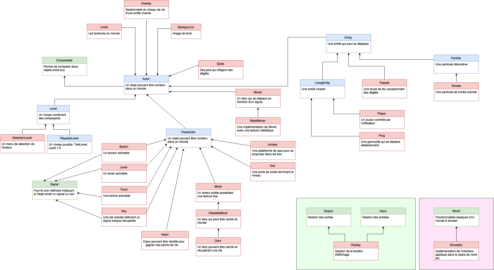

[//]: # (Pour voir ce fichier mis en page, veuillez utiliser un lecteur Markdown comme par exemple http://dillinger.io)

# Mini-projet 2

Réalisé par : _Florian CASSAYRE_ et _Moussa PRINCE_.

## Composants du jeu

Ce fichier contient tous les composants du jeu. Vous pouvez obtenir une vue d'ensemble de la structure en vous référant au schéma UML ci-dessous :

## Structure des paquets

### `platform.game.block`

#### `solid`

Contient les objets solides infranchissables (blocs, portes, movers...).

#### `transparent`

Contient les objets transparents qu'un joueur peut traverser (levier, torche, jumper...).

### `platform.game.entity`

#### `living`

Contient les entités vivantes (joueur, grenouille...), ainsi que le gestionnaire de leur niveau de vie (Overlay).

#### `particle`

Contient les effets physiques (fumée...).

#### `projectile`

Contient les objets à lancer (boules de feu...).

### `platform.game.environment`

Contient les éléments liés à l'environnement des acteurs (limites du monde, image de fond...).

### `platform.game.gui`

Contient les éléments liés à l'interface utilisateur (menu de sélection, boutons de sélection...)..

### `platform.game.item`

Contient les objets à récupérer par le joueur (cœurs, clés...).

### `platform.game.level`

Contient les niveaux de jeu, ainsi qu'un niveau de test.

### `platform.game.registry`

Contient les générateurs de blocs, utilisés pour concevoir les niveaux.

### `platform.game.signal`

Contient les signaux logiques (And, Or, Xor...).

### `platform.game.util`

Contient les utilitaires ainsi que les énumérations.

#### Interface `World`

"Fonctionnalités des mondes à simuler".

#### Classe `Simulator`

"Appelle en boucle la simulation de l'ensemble des acteurs et leur dessin".

## Acteurs

Ils héritent tous de la classe `Actor`.

### `Entity`

Une entité qui possède une position, une vitesse et une barre de vie.

#### `Particle`

Particules permettant de modéliser des effets décoratifs.

#### `SmokeParticle`

Une particule de fumée colorée.

#### `LivingEntity`

Une entité vivante (joueur, monstre...). Ces entités ont la particularité de posséder un `Overlay` (coeurs) au-dessus d'elles.

##### `Player` *

Le joueur contrôlé par l'utilisateur. Il peut se déplacer et interagir avec le monde grâce au clavier et la souris.

##### `Frog`

Une grenouille qui se déplace aléatoirement. Elle n'a un but que purement décoratif et n'interagit pas avec le joueur.

#### `Fireball` *

Une boule enflamée qui retire des points de vie à celui qui la touchera. La boule de feu rebondit sur les parois solides, mais sa vélocité s'atténue. A la longue, elle finit par disparaitre laissant derrière elle un nuage de fumée.

### `FixedActor`

Une classe mère qui permet de définir un acteur par une boite (`Box`) **fixe** (typiquement un bloc ou un objet d'interaction).

#### `Block` *

Tous les éléments qui sont dessinés en fond et qui intéragissent avec les entités lorsque ces dernières entrent en collision avec eux. Leur texture ne change pas.

##### `HideableBlock`

Classe abstraite représentant un bloc pouvant être caché du monde (et qui, par la même occasion, n'intéragit plus avec ce monde).

###### `Door` *

Porte qui est liée à une clé colorée. La couleur de la porte est naturellement définie par la clé passée en constructeur.

##### `Mover` *

Un bloc qui se déplace d'une position à une autre en fonction du signal passé en argument. Il est possible de choisir parmi deux modes d'interpolation, linéaire ou cubique (par défaut).

###### `MetalMover`

Très similaire à Mover, utilisant une texture prédéfinie.

## Signaux

### `Signal` *

Interface qui possède une méthode retournant un booléen si l'objet est "actif" ou non. Peut représenter un élément d'activation tel qu'un interrupteur ou un bouton.

#### `ConstantSignal` *

Un signal constant retournant le booléen passé en argument.

#### `Not` *

Inverse le signal passé en argument.

#### `LogicGate`

Classe intermédiaire représentant une porte logique (deux entrées, une sortie).

##### `And` *

"ET" logique ; les deux signaux doivent être vrais en même temps.

##### `Or` *

"OU" logique ; un des deux signaux au moins doit être vrai.

##### `Xor`

"OU Exclusif" logique ; un des deux signaux mais pas les deux, doit être vrai.

## Classes utilitaires

### `ColoredItem`

Une énumération contenant quatre couleurs possibles (bleu, vert, rouge, jaune) pour les objets colorés (clé, porte, bouton). Elle permet de récupérer automatiquement le nom de la texture en fonction de la couleur spécifiée.

### `ColoredSmoke`

Similaire à `ColoredItem` mais adapté à la fumée.

### `Direction`

Une énumération des quatre directions possibles (haut, bas, gauche, droite). Elle sert à définir l'orientation d'un blocs, par exemple le bloc pics (`Spike`).

### `InterpolationType`

Une énumération des types d'interpolation utilisables. Elle contient actuellement l'interpolation linéaire, et l'interpolation cubique. Cette énumération est utilisée par la classe `Mover` pour définir le type de transition. Elle pourrait également servir pour la transition entre deux niveaux.

### `Priority`

Toutes les constantes de priorités rassemblées en une classe pour simplifier la maintenance.

----------

 * : Classes obligatoires. Les autres composants ont été ajoutés en plus pour compléter le jeu. Il ne sont pas forcément utilisés dans nos niveaux mais pourront être utilisés par un autre développeur qui souhaite créer des niveaux.